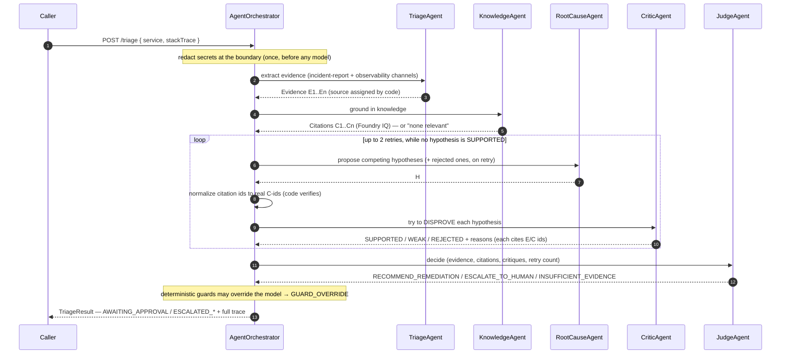

# Architecture — AI Incident Triage Agent ("AI SRE")

A **5-agent** system that triages a production incident: it reasons to a likely
**root cause**, **grounds** that reasoning in cited runbooks and past postmortems via
**Microsoft Foundry IQ**, drafts a fix, and writes a postmortem — then **stops for a
human to approve**. The agent never takes real action itself.

- **Orchestrator (my code):** a **deterministic** Spring Boot service (Planner-Executor).
  It owns the control flow; the model owns the reasoning inside each step.
- **Five specialized agents:** Triage → Knowledge → RootCause → **Critic** → Judge,
  each a plain `@Service` with its own focused prompt and its own success criteria.
- **Grounding (required):** Microsoft Foundry IQ (Azure AI Search agentic retrieval) —
  returns cited knowledge to reduce hallucination. One retrieval per incident.
- **Safety:** glass-box trace, boundary secret redaction, four-layer human-approval
  gate, and deterministic guards that can override the model ("model proposes, code verifies").

> Built with AI-assisted development (GitHub Copilot / Claude Code).

## Named patterns

- **Planner-Executor** — `AgentOrchestrator` runs a fixed plan in Java; model output never redirects control flow.
- **Critic-Verifier** — `CriticAgent` is adversarial to `RootCauseAgent`, trying to *disprove* each hypothesis.
- **Self-reflection retry** — when no hypothesis is SUPPORTED, the killed hypotheses + reasons are fed back for a genuine re-think (≤ 2 retries).
- **Role-based specialization** — five narrow roles instead of one mega-prompt; each independently testable and auditable.

## Component view

```mermaid
flowchart TD
    Client["Caller (curl / Postman / demo)"] -->|"POST /triage&#10;{ service, stackTrace }"| Controller["TriageController&#10;@RestController"]
    Controller --> Orchestrator

    subgraph Orchestrator["AgentOrchestrator — deterministic Planner-Executor (my code)"]
        direction TB
        Redact["① SecretRedactor&#10;redact raw input ONCE (boundary)"]
        Triage["② TriageAgent&#10;raw signals ➜ Evidence E1..En"]
        Knowledge["③ KnowledgeAgent&#10;➜ Citations C1..Cn"]
        RootCause["④ RootCauseAgent&#10;2–3 competing Hypotheses H# (+ E/C ids)"]
        Critic["⑤ CriticAgent (adversarial)&#10;SUPPORTED / WEAK / REJECTED + reasons"]
        Judge["⑥ JudgeAgent&#10;RECOMMEND / ESCALATE / INSUFFICIENT"]
        Guards["⑦ Guards (code verifies)&#10;GUARD_OVERRIDE / PROVENANCE_NORMALIZED"]
        Redact --> Triage --> Knowledge --> RootCause --> Critic
        Critic -. "no hypothesis SUPPORTED&#10;feed rejections back (≤ 2 retries)" .-> RootCause
        Critic --> Judge --> Guards
    end

    Triage --> Model
    RootCause --> Model
    Critic --> Model
    Judge --> Model
    Model["FoundryModelClient"] <-->|"HTTPS /openai/v1/chat/completions&#10;api-key • reasoning_effort=low"| Foundry[("Microsoft Foundry&#10;gpt-5.4")]
    Knowledge -->|"retrieve(query) — 1×/incident"| Iq["FoundryIqClient"]
    Iq <-->|"HTTPS agentic retrieval"| IQ[("Microsoft Foundry IQ&#10;Azure AI Search&#10;cited knowledge")]

    Guards --> Result["TriageResult&#10;status = AWAITING_APPROVAL / ESCALATED_*"]
    Result -->|"200 OK — JSON + glass-box trace"| Client
    Human["Human reviewer"] -. "approves before ANY real action" .-> Result
```

All agents read and write one shared **`IncidentContext`** (evidence, citations,
hypotheses with provenance, critiques, decision, and the trace). **Write discipline**
is enforced by the type system: each agent receives a narrow view (`TriageView`,
`JudgeView`, …) that can read everything but write only its own section — writing a
foreign section is a compile error.

## The pipeline, step by step

## Configuration & flags

| Flag (`application.yml`) | Value | Effect |
| --- | --- | --- |
| `foundry.enabled` | `true` | `true` → real model-driven pipeline (gpt-5.4). `false` → deterministic offline stub (canned, no network) so the baseline runs without keys. |
| `foundry.iq.enabled` | `true` | `true` → real Foundry IQ retrieval. `false` → `KnowledgeAgent` falls back to the two bundled sample docs. |

The RootCause⇄Critic retry cap is a code constant (`AgentOrchestrator.MAX_RETRIES = 2`).
Secrets (`FOUNDRY_API_KEY`, `FOUNDRY_IQ_API_KEY`) come from environment variables only
and are never committed. Endpoint paths, api-versions, and auth headers live in
`application.yml` as configurable values.
