# Architecture — AI Incident Triage Agent ("AI SRE")

An AI agent that triages a production incident: it reasons step by step to find the
likely **root cause**, **grounds** that reasoning in cited runbooks and past
postmortems via **Microsoft Foundry IQ**, drafts a fix, and writes a postmortem —
then **stops for a human to approve**. The agent never takes real action itself.

- **Orchestrator (my code):** Spring Boot REST service — owns the reasoning *loop*.
- **Brain (not my code):** the Microsoft Foundry model — makes each *decision* inside a turn.
- **Grounding (required):** Microsoft Foundry IQ — returns cited knowledge to reduce hallucination.
- **Tools:** five Java functions the model may call (logs, metrics, knowledge, code, draft-fix).
- **Trace + safety:** step trace, hard iteration cap, draft-only fixes, human approval gate.

> Built with AI-assisted development (GitHub Copilot / Claude Code).

## Component view

```mermaid
flowchart TD
    Client["Caller (curl / demo UI)"]
    Client -->|"POST /triage&#10;JSON: { service, stackTrace }"| Controller

    subgraph Orchestrator["Spring Boot Orchestrator — my code (owns the LOOP)"]
        Controller["TriageController&#10;@RestController"]
        Loop["ReasoningLoop&#10;@Service"]
        Registry["ToolRegistry&#10;dispatch by name"]
        Safety["Safety + Trace&#10;iteration cap • draft-only • approval gate • step trace"]
        Controller --> Loop
        Loop --- Safety
        Loop -->|"execute(name, args)"| Registry
    end

    Loop <-->|"each turn:&#10;messages + tool specs ➜ tool calls / final JSON"| ModelClient["FoundryModelClient&#10;(ModelClient interface)"]
    ModelClient <-->|"HTTPS — /openai/v1/chat/completions&#10;api-key auth • reasoning_effort=low"| Foundry[("Microsoft Foundry&#10;MODEL = the BRAIN&#10;gpt-5-mini (reasoning)")]

    subgraph Tools["The 5 Tools (Java functions)"]
        direction LR
        GetLogs["get_logs"]
        GetMetrics["get_metrics"]
        SearchK["search_knowledge"]
        ReadCode["read_code"]
        DraftFix["draft_fix&#10;(drafts ONLY)"]
    end
    Registry --> GetLogs
    Registry --> GetMetrics
    Registry --> SearchK
    Registry --> ReadCode
    Registry --> DraftFix

    SearchK -->|"retrieve(query)"| IqClient["FoundryIqClient"]
    IqClient <-->|"HTTPS — retrieval"| IQ[("Microsoft Foundry IQ&#10;GROUNDING + citations")]

    Loop -->|"TriageResult&#10;status = AWAITING_APPROVAL"| Controller
    Controller -->|"200 OK — JSON"| Client

    Human["Human reviewer"] -.->|"approves before any real action"| Client
```



## The reasoning loop, one turn at a time

```mermaid
sequenceDiagram
    participant C as Caller
    participant T as TriageController
    participant L as ReasoningLoop
    participant M as Foundry model
    participant K as ToolRegistry + Tools
    participant IQ as Foundry IQ

    C->>T: POST /triage { service, stackTrace }
    T->>L: triage(incident)
    Note over L: messages = [system prompt, incident]

    loop up to agent.max-iterations (default 6)
        L->>M: nextTurn(messages, tool specs)
        alt model asks for tools
            M-->>L: tool_calls (e.g. get_logs, search_knowledge)
            L->>K: execute(name, args)
            K-->>L: tool result text
            opt search_knowledge
                K->>IQ: retrieve(query)
                IQ-->>K: cited snippets [SOURCE: ...]
            end
            L->>L: append assistant + tool results to messages; record trace
        else model is done
            M-->>L: final JSON conclusion (no tool calls)
            L->>L: parse -> TriageResult (AWAITING_APPROVAL)
        end
    end

    Note over L: cap reached without a conclusion -> ESCALATED_ITERATION_CAP
    L-->>T: TriageResult
    T-->>C: 200 OK (JSON)
```

## Feature flags (so the baseline always runs without credentials)

| Flag | Current (`application.yml`) | Effect |
| --- | --- | --- |
| `foundry.enabled` | `true` | `true` → real model-driven loop (gpt-5-mini). `false` → Phase-1 stub path (canned data, no network). |
| `foundry.iq.enabled` | `false` | `false` → `search_knowledge` returns canned cited snippets. `true` → real Foundry IQ retrieval. |
| `agent.max-iterations` | `6` | Hard cap on model turns per incident (safety + cost guard). |
| `agent.min-confidence-to-propose` | `0.6` | Below this the agent should escalate rather than propose (full enforcement in Phase 3). |

Secrets (`FOUNDRY_API_KEY`, `FOUNDRY_IQ_API_KEY`) come from environment variables only and
are never committed. Foundry/IQ endpoint paths, api-versions, and auth headers live in
`application.yml` as configurable values — confirm the exact shapes on Microsoft Learn.
